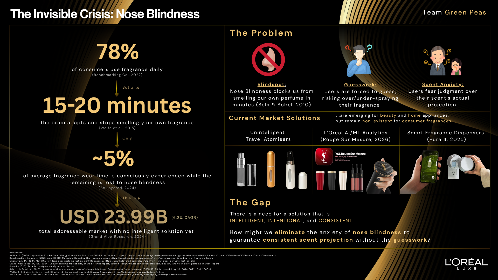
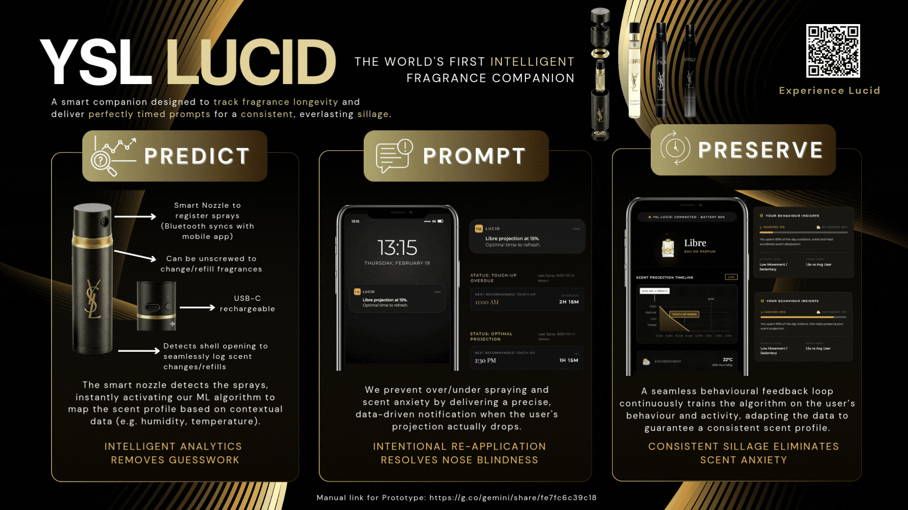
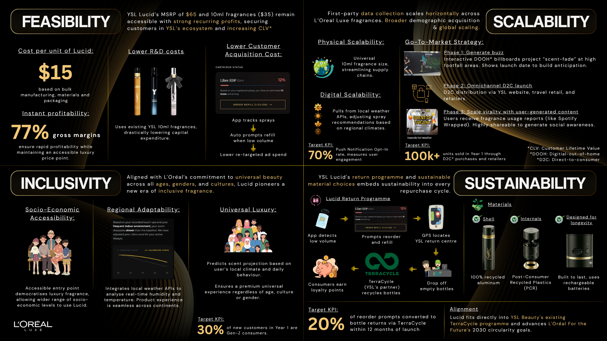

# YSL Lucid: The World's First Smart Fragrance Companion 

> **Project Status:** Prototype / Concept  
> **Context:** Developed as a competitive submission for the L'Oréal Brandstorm competition. 

## 📖 Overview
YSL Lucid is a smart 10ml fragrance shell designed to eliminate nose blindness. By utilising a predictive analytics engine that analyses real-time climate data and user spray habits, the companion app delivers perfectly timed prompts to ensure a flawless, consistent sillage without the guesswork.

## ⚠️ The Problem: Scent Anxiety & Nose Blindness
* **The Physiological Gap:** The human brain adapts to scents within 15 to 20 minutes, meaning wearers only consciously experience ~5% of their fragrance's wear time.
* **The Behavioural Flaw:** Without knowing their actual projection, users are forced to guess. This leads to over-spraying (choking a room) or under-spraying (losing their signature scent).
* **The Emotional Toll:** This guesswork breeds "Scent Anxiety", which is a loss of confidence driven by the fear of social judgement. 

## 💡 The Solution: Predict, Prompt, Preserve
Lucid bridges the gap between hardware and data. It transforms existing 10ml YSL travel vials into an intelligent, data-driven ecosystem.

1. **Predict (Hardware Integration):** A Bluetooth-enabled smart shell tracks exact spray counts and logs cartridge swaps. 
2. **Prompt (Predictive Analytics):** The mobile app ingests continuous time-series environmental data (temperature, humidity, indoor/outdoor micro-climates) via weather APIs to calculate a dynamic evaporation curve for the specific fragrance chemistry.
3. **Preserve (User Action):** The user receives a precise, data-driven push notification the exact minute their projection falls below the optimal threshold. 

## ⚙️ Technical Logic & Architecture 
*This repository contains the conceptual UI prototypes and algorithmic logic framework for the Lucid ecosystem.*

* **Data Ingestion:** Real-time localisation APIs (weather, humidity) alongside Bluetooth Low Energy (BLE) actuation triggers.
* **Predictive Modelling Framework:** Designed to utilise time-to-event modelling (e.g. survival analysis or gradient-boosted regression) to map non-linear environmental variables against baseline fragrance dissipation rates.
* **State Management:** "Smart Sync" software logic pauses and resumes volume states when users hot-swap physical fragrance vials, completely removing the need for expensive NFC hardware.

## 📈 The Business Case
Lucid was designed not just as a tech novelty, but as a highly viable, scalable business model for L'Oréal Luxe:

* **Feasibility:** Engineered for a lean $15 BOM utilising recycled aluminium and PCR plastics, unlocking 77% gross margins.
* **Sustainability:** Drives a closed-loop circular economy. App prompts direct users to YSL counters for TerraCycle recycling in exchange for loyalty points.
* **Scalability:** The $65 entry point democratises luxury, acting as a data-rich gateway for Gen-Z consumer acquisition. 

## 👥 The Team
* **Sophia** - [Market Research, Design, Inclusivity Initiatives]
* **Shynne** - [Market Research, Consumer Behaviour Research, Sustainability Initiatives]
* **Jung Yong** - [Product Vision, Analytics, Marketing, Operations, Prototyping, Feasibility, Scalability, Innovation]
